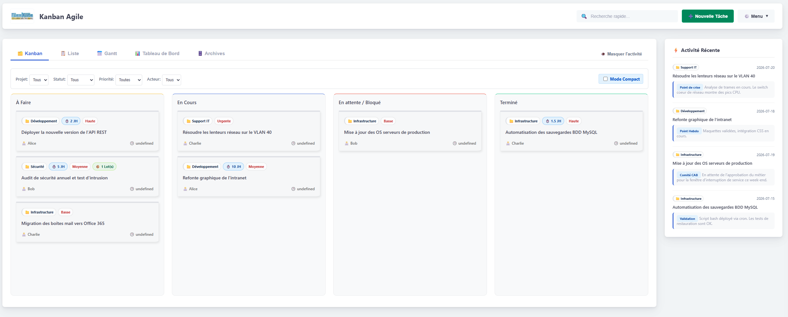
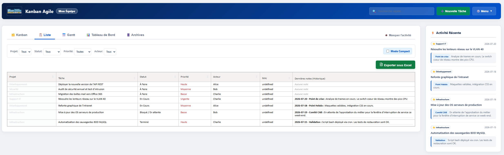
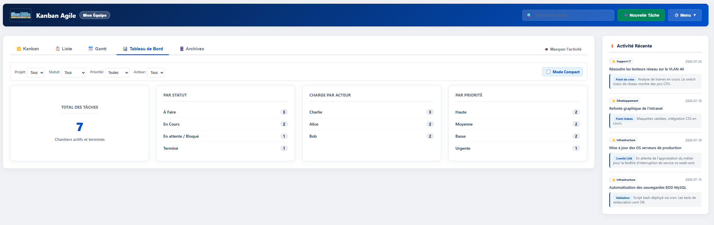
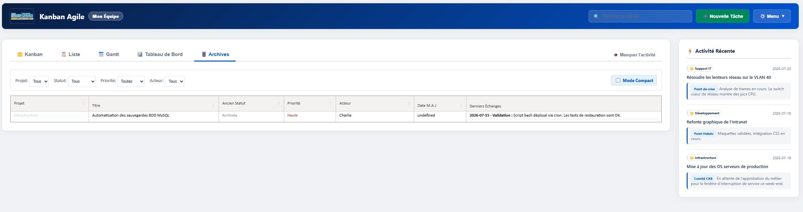
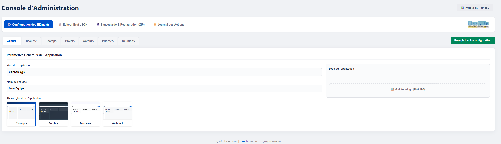

[DOCUMENTATION.md](https://github.com/user-attachments/files/30188295/DOCUMENTATION.md)
# 📘 Documentation Fonctionnelle - FlexKlite

  

**FlexKlite** est une application web légère, intuitive et réactive conçue pour la gestion de tâches et le suivi de chantiers. Elle permet de suivre l'avancement des projets via de multiples vues synchronisées et offre un système avancé de traçabilité et d'historisation.

---

## 👥 Rôles et Droits d'Accès

FlexKlite fonctionne avec deux niveaux d'accès fluides :

1. **Mode Visiteur (Lecture seule) :** 
   - Toute personne ayant accès à l'URL de l'application peut consulter l'ensemble des données (Kanban, Listes, Tableaux de bord, Archives, Historiques).
   - Les actions de modification (clic-droit, glisser-déposer, édition) sont désactivées et déclenchent une **modale de connexion** expliquant la nécessité de s'authentifier.
   
2. **Mode Administrateur (Connecté) :**
   - Accessible via le bouton "Se connecter" ou via la modale de restriction.
   - Accès complet à l'édition des tâches, des notes, de la configuration globale de l'application (projets, acteurs, sécurité) et de l'archivage.

---

## 👁️ Les Vues Principales

### 1. 🗂️ Vue Kanban
C'est le tableau de bord opérationnel quotidien.

  

- **Colonnes :** Les tâches transitent de gauche à droite (`À Faire` ➔ `En Cours` ➔ `Bloqué` ➔ `Terminé`).
- **Drag & Drop :** Glissez et déposez facilement les cartes d'une colonne à l'autre (mode Admin uniquement).
- **Mode Compact :** Accessible via une case à cocher dans la barre de filtre. Ce mode condense les cartes et les **regroupe visuellement par projet** au sein de chaque colonne pour une lecture analytique.

### 2. 📋 Vue Liste
Une vue structurée pensée pour ressembler à un **tableau Excel**.

  

- Affichage brut des données sans fioritures ni icônes parasites.
- Les 5 dernières notes de l'historique d'une tâche y sont directement intégrées et lisibles d'un coup d'œil.
- **Export Excel :** Un bouton permet d'exporter la vue filtrée instantanément au format `.xlsx`.

### 3. 📅 Vue Gantt (Planning)
Une représentation chronologique de vos chantiers et tâches.
- **Visualisation dans le temps :** Les tâches ayant une date de début et une date de fin s'affichent sous forme de barres horizontales sur un calendrier.
- **Interactivité :** (En mode administrateur) Glissez-déposez les barres pour modifier les dates ou cliquez dessus pour ouvrir la fiche de la tâche.
- **Filtres globaux :** La timeline s'adapte instantanément à vos recherches et filtres (Projet, Acteur, Statut).
- **Activation :** Cette vue peut être activée ou désactivée à volonté depuis la Console d'Administration.

### 4. 📊 Tableau de Bord (KPI)
Analyse en temps réel de votre activité.

  

- Volume total de tâches.
- Répartition par statut, par acteur et par priorité pour équilibrer la charge de travail.

### 5. 🗄️ Archives
Le stockage à froid de l'application.

  

- Les tâches archivées sortent du cycle actif (Kanban/Liste) pour ne pas polluer l'espace de travail.
- Elles restent consultables via le même affichage "Excel" avec un accès total à leur historique et à leurs pièces jointes.

---

## ⚙️ Fonctionnalités Clés et Outils

### 🔍 Filtres Globaux Persistants
Une barre de filtre est omniprésente en haut de l'écran :
- Filtrez instantanément par **Recherche rapide**, **Projet**, **Statut**, **Priorité**, et **Acteur**.
- Les filtres se répercutent automatiquement sur *tous* les onglets (Kanban, Liste, Archives).
- **Persistance :** Les filtres sont enregistrés dans la mémoire de votre navigateur. Si vous actualisez la page, vous retrouvez exactement votre contexte de recherche.

### 🖱️ Le Menu Contextuel Rapide
Un simple **clic-droit** sur n'importe quelle carte ou ligne de tableau ouvre un menu contextuel :
- **➕ Ajouter un point de suivi :** Ouvre le panneau pour saisir immédiatement une note.
- **✏️ Modifier les paramètres :** Ouvre la modale d'édition globale de la tâche.
- **🗄️ Archiver la tâche :** Bascule la tâche dans l'onglet Archives.

### 📝 Le Panneau de Détails & Suivi (Historique)
Un **clic gauche** sur une tâche ouvre son panneau d'historique latéral :
- **Chronologie complète :** Suivez toutes les notes ajoutées, leurs dates, et le contexte (ex: Réunion Client, Comité de Direction).
- **Pièces jointes :** Visualisez les images via de petites miniatures, et accédez aux documents (PDF, Docx) en un clic.
- **Lots / Sous-tâches :** Pour les gros chantiers, possibilité de déclarer des lots pour structurer les notes par périmètre.

### ⚡ La Sidebar d'Activité
Un panneau latéral droit retrace le flux des "Derniers Échanges". Il affiche en permanence les 5 derniers points d'historique enregistrés sur l'ensemble du système, permettant de suivre la dynamique de l'équipe sans ouvrir chaque carte. Il peut être masqué d'un simple clic pour gagner de la place.

### 🛠️ Configuration & Paramétrages
Accessible depuis le menu supérieur (icône engrenage) :

  

- **Personnalisation & Thèmes :** Sélectionnez l'apparence globale de l'application parmi 4 thèmes complets (Classique, Sombre, Moderne, Architect).
- **Listes déroulantes personnalisables :** Ajoutez ou modifiez vos Acteurs, Projets, Niveaux de priorité et Types de réunion. Les couleurs des projets sont également personnalisables.
- **Sécurité :** Définition du mot de passe Admin, et possibilité de forcer un mot de passe même pour la simple lecture de l'application (mode privé).
- **Maintenance :** Outils pour exporter la base de données brute (`kanban.json`) en sauvegarde, et importer un fichier ZIP pour restaurer un environnement.

---

## 💾 Architecture Technique
- Application full web "Server-Side & Client-Side" légère.
- Les données (Tâches, Historiques, Configuration) sont stockées dans des fichiers JSON plats locaux, garantissant une forte portabilité et évitant le besoin d'une base de données SQL lourde.
- Les fichiers chargés (pièces jointes, logos) sont stockés dans un répertoire `/uploads` isolé.
